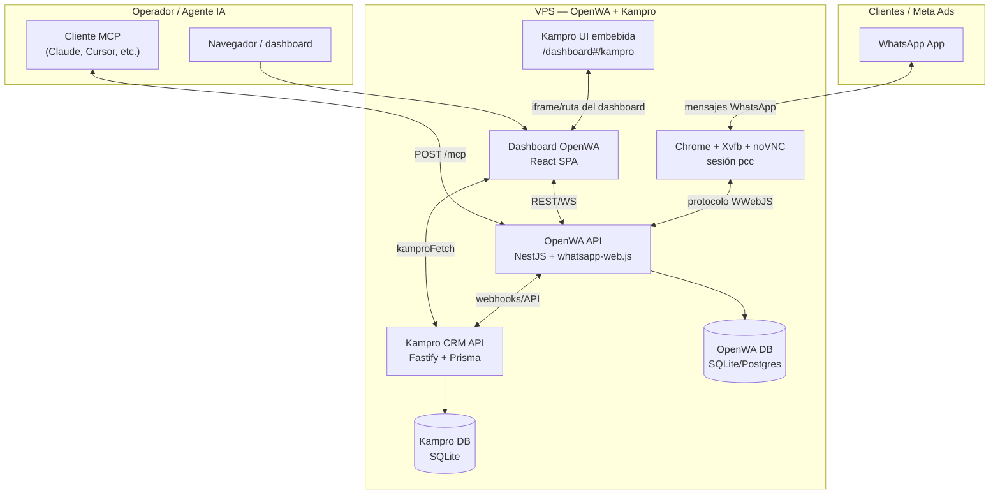

# 01-arquitectura.md

> **Propósito:** Diagrama de componentes y responsabilidades del sistema Kampro + OpenWA.  
> **Fecha de generación:** 2026-09-19.  
> **Aviso:** Generado a partir del código; revisar con lógica de negocio antes de actuar.

## Diagrama de componentes (Mermaid)

[CONFIRMADO] OpenWA y Kampro comparten el mismo host/VPS pero no la misma base de datos. Ver `kampro/prisma/schema.prisma` y `src/app.module.ts`.

## Responsabilidades de cada módulo

| Módulo | Ruta | Responsabilidad |
|--------|------|-----------------|
| OpenWA API | `src/` | Gateway WhatsApp: sesiones, mensajes, webhooks, media, autenticación por API key, MCP server. |
| Dashboard OpenWA | `dashboard/src/` | Interfaz React para administrar sesiones, webhooks, ver chats; integra paneles de Kampro (`dashboard/src/pages/Orders.tsx`, `Accounting.tsx`). |
| Kampro CRM API | `kampro/src/api/routes.ts` | API REST Fastify de productos, proveedores, órdenes de compra, pedidos de clientes, pagos, facturas y contabilidad. |
| Reglas de negocio Kampro | `kampro/src/domain/` | Funciones puras: transiciones de pedido, cálculo de IVA, asientos contables, PEPS, numeración de facturas. |
| Servicios Kampro | `kampro/src/services/` | Orquestación con Prisma, notificaciones a grupos de WhatsApp, cierre contable. |
| UI Kampro importaciones | `kampro/public/` | HTML+JS vanilla para la gestión de importaciones/OC; servida desde `kampro/src/api/ui.ts`. |

## Flujo de datos típico

### Venta por WhatsApp (delivery Asunción)

1. Cliente escribe al número corporativo.
2. `OWA` recibe `message.received` y lo muestra en el dashboard.
3. Operador usa `OrderQuickPanel` (`dashboard/src/components/chats/OrderQuickPanel.tsx`) para crear un pedido en `KAPI`.
4. `KAPI` reserva stock (`kampro/src/services/stock.service.ts`) y envía una notificación al grupo de ventas vía API de OWA (`kampro/src/services/openwa.service.ts`).
5. Al marcar enviado/entregado, `KAPI` consume stock PEPS, genera factura y asientos contables.

### Importación (orden de compra a China)

1. Operador carga OC en `kampro/public/index.html` → `POST /purchase-orders`.
2. Al confirmar pago: `POST /purchase-orders/:id/confirm` genera asiento `TRANSITO / BANCO`.
3. Al cerrar recepción: `POST /purchase-orders/:id/close` suma unidades a inventario y carga lote PEPS (`kampro/src/services/fifo.service.ts`).

## Dependencias entre módulos

- `dashboard` → `OpenWA API` y `Kampro API`.
- `Kampro API` → `OpenWA API` solo para **enviar mensajes/notificaciones**; nunca lee la base de datos de OpenWA directamente.
- `OpenWA API` → WhatsApp vía `whatsapp-web.js`.
- No hay dependencia de proveedor de IA en el CRM; el MCP server de OpenWA es consumido por agentes externos.

## Límites arquitectónicos

- El motor de WhatsApp (`whatsapp-web.js`) usa un navegador real en el VPS; no se puede escalar horizontalmente la sesión.
- Kampro corre como proceso aparte en el mismo VPS; en local se arranca manualmente (`npm run dev` en `kampro/`).
- El dashboard React y la UI vanilla de importaciones conviven; la primera en React para pedidos/contabilidad, la segunda para OC.
